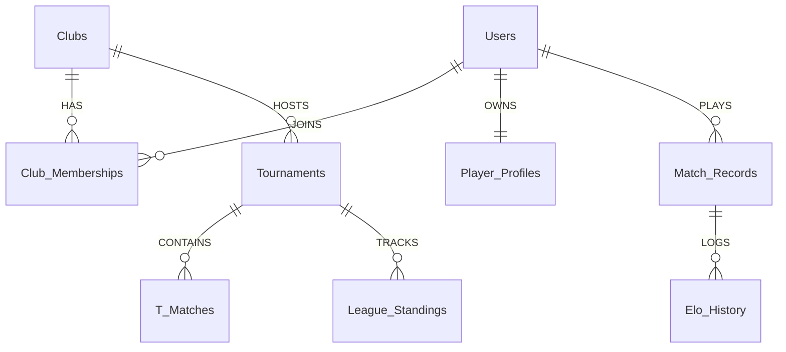

# System Architecture & Technical Design

This document details the architectural design, domain math formulation, database strategy, and component interactions of the **eFootball Club Management & Analytics Tool (`cmtool`)**.

---

## 1. Architectural Strategy (Hexagonal Architecture / Ports & Adapters)

The application adopts **Hexagonal Architecture** (Ports and Adapters) to achieve complete decoupling between the core business domain logic and external infrastructure drivers:

```mermaid
graph TD
    Client[Flutter Mobile App / Desktop] -->|HTTP REST JSON| AxumAPI[Axum Web Server / API Layer]
    AxumAPI -->|Calls Domain Trait| Ports[Domain Ports & Math Engines]
    
    subgraph Core Domain Logic (Pure Rust - Zero IO)
        Ports --> EloEngine[Dynamic Elo Math Engine]
        Ports --> MpsEngine[Match Performance Score MPS]
        Ports --> TournamentOps[Knockout & Round-Robin Schedulers]
        Ports --> PlayStyle[Play Style Classifier & Badges]
        Ports --> FallbackAI[Deterministic AI Fallback Engine]
    end

    subgraph Infrastructure Adapters
        AxumAPI -->|SQLx PgPool| PostgresAdapter[PostgreSQL / Supabase Adapter]
        AxumAPI -->|Reqwest Client| GeminiAdapter[Google Gemini LLM API Adapter]
    end
```

### Key Architectural Rules

1. **Zero-IO Business Domain**: Math calculation functions in `backend/src/domain/` (`elo.rs`, `mps.rs`, `tournament.rs`, `play_style.rs`) are pure functions operating on value types. They have zero direct database or network calls, allowing 100% deterministic unit testing without mocks.
2. **Stateless Backend**: The Axum backend server holds no mutable shared state in memory except for the pooled database handle (`sqlx::PgPool`). This enables horizontal scaling behind cloud load balancers.
3. **Feature Flags & Fallbacks**: If external cloud APIs (e.g. Gemini LLM) experience rate limits or network outages, the system automatically falls back to deterministic rule-based template generation without returning errors.

---

## 2. Core Mathematical Formulations

### A. Dynamic Elo Rating System ($1v1$ & $2v2$)
Measures long-term player skill. Expected score $E$ for a player against opponent:

$$E = \frac{1}{1 + 10^{(R_{opp} - R_{player}) / 400}}$$

Adjusted rating delta calculation:

$$\Delta R = K \cdot (S - E)$$

Where dynamic $K$-factor is scaled by margin of victory and provisional status:

$$K = K_{base} \cdot M_{margin} \cdot M_{provisional}$$

- $K_{base}$: $40$ for Tournament Finals, $32$ for League, $16$ for Friendlies.
- $M_{margin} = \ln(1 + |\text{Goals For} - \text{Goals Against}|)$.
- $M_{provisional} = 1.5$ for players with $< 10$ recorded matches.

### B. Match Performance Score (MPS, 0–100)
Evaluates match performance relative to player standards adjusted for opponent difficulty $C_{opp}$:

$$\text{MPS} = \min\left(100, \left( 0.20 \cdot S_{possession} + 0.30 \cdot S_{passing} + 0.30 \cdot S_{efficiency} + 0.20 \cdot S_{defense} \right) \times C_{opp} \right)$$

- $S_{possession} = \text{Possession Percentage}$
- $S_{passing} = \frac{\text{Passes Completed}}{\max(1, \text{Passes Attempted})} \times 100$
- $S_{efficiency} = \frac{\text{Goals Scored}}{\max(1, \text{Shots on Target})} \times 100$
- $S_{defense} = \min(100, \text{Interceptions} \times 10)$
- $C_{opp} = \text{clamp}\left(1.0 + \frac{R_{opp} - R_{player}}{2000}, 0.8, 1.2\right)$

---

## 3. Database Strategy & Table Relationships

The database schema ([migrations/20260731000000_initial_schema.sql](file:///home/nulL/Documents/cmtool/migrations/20260731000000_initial_schema.sql)) consists of **12 PostgreSQL tables**:



### Table Dictionary

| Table Name | Primary Key | Description |
| :--- | :--- | :--- |
| `Clubs` | `UUID` | Club organization entity with unique invite code. |
| `Users` | `UUID` | User accounts with auth credentials & username. |
| `Club_Memberships` | `(player_id, club_id)` | Junction table supporting multi-club membership & roles (`admin`, `organizer`, `player`). |
| `Player_Profiles` | `user_id` | Rolling player ratings (`skill_rating`, `form_rating`, `play_style`). |
| `Tournaments` | `UUID` | Tournament events (`knockout`, `round_robin`, `swiss`, `league`). |
| `T_Matches` | `UUID` | Tournament fixture nodes. |
| `Match_Records` | `UUID` | Verified post-match OCR stats & SHA-256 screenshot hash deduplication. |
| `Elo_History` | `BIGSERIAL` | Audit log of rating movements (`rating_before`, `rating_after`). |
| `League_Standings` | `(tournament_id, player_id)` | Round-Robin / League standings table. |
| `Squad_Verifications` | `UUID` | Pre-match squad team strength verification records. |
| `Match_Disputes` | `UUID` | Dispute resolution queue (`open`, `resolved`, `dismissed`). |
| `Seasons` / `Season_Snapshots` | `UUID` | Season archive snapshots preventing rating stagnation. |

---

## 4. Security Architecture

1. **Password Security**: Passwords are hashed using the **Argon2id** algorithm with a cryptographically secure random salt generated via `OsRng`.
2. **Session Authentication**: Authenticated requests issue signed 24-hour **JWT bearer tokens** containing claims (`sub`, `username`, `exp`).
3. **Database Security (RLS)**: PostgreSQL Row-Level Security (RLS) policies enforce data isolation ensuring match data is visible only to members within the same club.
