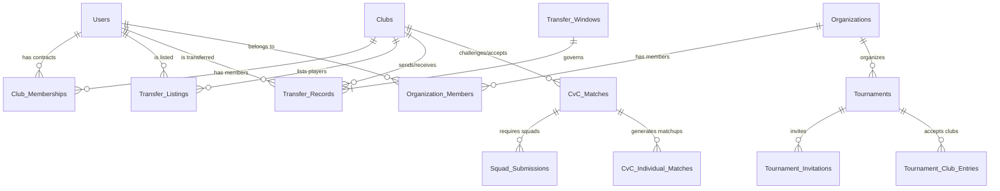

# Feature Expansion: Transfer Market, CvC, Universal Tournaments & Organizations

> System design document for the next major feature expansion of the eFootball Club Management & Analytics Tool.

---

## Table of Contents

1. [New Entity Model](#1-new-entity-model)
2. [Transfer Market System](#2-transfer-market-system)
3. [Contract System](#3-contract-system)
4. [Transfer Authorization & Governance](#4-transfer-authorization--governance)
5. [Club-vs-Club (CvC) Matches](#5-club-vs-club-cvc-matches)
6. [Squad Submission System](#6-squad-submission-system)
7. [Universal Tournaments](#7-universal-tournaments)
8. [Organizations & Communities](#8-organizations--communities)
9. [New Database Schema](#9-new-database-schema)
10. [New API Endpoints](#10-new-api-endpoints)
11. [Backend Architecture Additions](#11-backend-architecture-additions)
12. [Mobile Screen Additions](#12-mobile-screen-additions)
13. [Design Decisions Log](#13-design-decisions-log)

---

## 1. New Entity Model

The expansion introduces **4 new top-level entities** and modifies **2 existing entities**:



### New Entities

| Entity | Purpose |
|--------|---------|
| **Transfer_Windows** | Platform admin-controlled periods when transfers are allowed |
| **Transfer_Listings** | Players listed on the transfer market with asking price & type |
| **Transfer_Records** | Immutable ledger of all completed transfers |
| **Organizations** | Communities/groups that organize cross-club tournaments |
| **Organization_Members** | Users who belong to an organization with roles |
| **CvC_Matches** | Club-vs-Club challenge events |
| **CvC_Individual_Matches** | Individual 1v1 matches within a CvC event |
| **Squad_Submissions** | Sealed squad lineups for CvC matches or tournament rounds |
| **Tournament_Invitations** | Invitations for invitational-scope tournaments |
| **Tournament_Club_Entries** | Club registrations for CvC tournaments |

### Modified Entities

| Entity | Changes |
|--------|---------|
| **Club_Memberships** | + `contract_start`, `contract_end`, `contract_status` columns |
| **Clubs** | + `transfer_mode` (`'free'` or `'currency'`), + `club_elo`, + `max_roster_size`, + `description`, + `logo_url`, + `is_public` |
| **Tournaments** | `club_id` becomes nullable, + `scope` field, + `org_id` FK |
| **T_Matches** | + optional `club_a_id` / `club_b_id` for CvC tournament fixtures |

---

## 2. Transfer Market System

### Transfer Types

| Type | Description | Approval Flow |
|------|-------------|---------------|
| **Free Transfer** | Player moves without virtual currency | Player requests → Selling club approves → Buying club confirms |
| **Buyout Transfer** | Buying club pays virtual currency points | Buying club offers → Selling club approves → Player accepts |
| **Loan** | Temporary move (match count or date-based) | Both clubs approve → Player accepts |
| **Player Swap** | Two clubs exchange players simultaneously | Both clubs approve → Both players accept |
| **Release / Drop** | Club removes a player from roster | Club admin unilateral → Player becomes free agent |

### Transfer Listing States

```
[created] → listed → pending_approval → accepted → completed
                   → withdrawn                    
                   → rejected
                   → counter_offer → pending_approval
```

### Hybrid Economy Model

Each club individually chooses its transfer mode:

- **`'free'` mode**: Transfers are admin-approved roster movements. No virtual currency involved.
- **`'currency'` mode**: Transfers involve virtual currency points. Clubs earn points via match wins, tournament placements, and season milestones.

When two clubs with different modes interact:
- If the **selling club** is in `currency` mode, a fee is required from the buying club.
- If the **selling club** is in `free` mode, no fee is needed regardless of buyer's mode.

### Player Valuation Formula

For clubs in `currency` mode, player values are computed as:

```
V = BaseValue(Elo) × M_form × M_consistency × M_scarcity
```

| Factor | Calculation |
|--------|-------------|
| **BaseValue** | Elo tiers: 800–999 → 100pts, 1000–1199 → 250pts, 1200–1399 → 500pts, 1400+ → 1000pts |
| **M_form** | `form_rating / 50.0` (normalized around 1.0) |
| **M_consistency** | Inverse of MPS standard deviation over last 10 matches |
| **M_scarcity** | Multiplier if player's play style is rare in buyer's roster |

### Elo Reset Policy

When a player transfers to a new club, their `skill_rating` resets to **1000** and `form_rating` resets to **50.00** in the new club. Historical ratings are preserved in `Elo_History` and `Season_Snapshots`.

### Anti-Abuse Rules

- **7-day cooldown** between transfers (configurable)
- **Tournament lock**: Players in active tournaments cannot be transferred
- **Squad lock**: Players in submitted CvC squads cannot be transferred until the event concludes

---

## 3. Contract System

Every club membership is now a **time-bound contract**.

### Contract Properties

| Field | Type | Description |
|-------|------|-------------|
| `contract_start` | `TIMESTAMPTZ` | When the player joined / contract signed |
| `contract_end` | `TIMESTAMPTZ` | When the contract expires (NULL = indefinite for legacy) |
| `contract_status` | `VARCHAR(20)` | `'active'`, `'expiring_soon'`, `'expired'` |

### Contract Lifecycle

```
[join club] → active → expiring_soon (≤14 days left) → expired → free_agent
                     → terminated (club releases early) → free_agent
             active ← renewed (contract extended)
```

### Key Rules

- **Expired contracts**: Player automatically becomes a **free agent** — can join any club without selling club approval (Bosman principle)
- **Expiring soon notification**: 14 days before expiry, status changes to `expiring_soon` — club admin can offer renewal
- **Renewal**: Club admin offers new end date → Player accepts or rejects
- **Early termination**: Club admin can release a player with an active contract (player goes to free agent pool)
- A **nightly cron job** (Supabase pg_cron or backend scheduled task) processes contract status transitions

---

## 4. Transfer Authorization & Governance

Three-layer authorization model:

### Layer 1 — Platform Admin ("FIFA")

- Controls **global transfer windows** — sets open/close dates
- Outside the window, all transfer API calls return `TRANSFER_WINDOW_CLOSED` error
- Can force-complete or cancel stuck transfers

### Layer 2 — Club Admins ("National FA")

- Approve/reject outgoing transfer requests
- List players on the transfer market
- Release players (terminate contracts early)
- Accept/reject incoming offers
- Offer contract renewals

### Layer 3 — Players

- Request a transfer
- Accept/reject offers from buying clubs
- Walk away as free agent when contract expires (no approval needed)
- Accept/reject contract renewal offers

### Authorization Matrix

| Action | Window Required | Club Admin | Player | System |
|--------|:-:|:-:|:-:|:-:|
| List on market | ✅ | ✅ Approves | — | Validates eligibility |
| Make offer | ✅ | ✅ Buying club | — | Validates roster size |
| Accept offer | ✅ | ✅ Selling club | ✅ Must accept | Executes transfer |
| Free agent sign | ✅ | ✅ Buying club | ✅ Accepts | Validates roster |
| Contract expires | — | — | — | ✅ Automatic |
| Release player | — | ✅ Unilateral | — | Moves to FA pool |
| Contract renewal | — | ✅ Offers | ✅ Accepts | Updates dates |

---

## 5. Club-vs-Club (CvC) Matches

### Overview

A structured inter-club event where two clubs each submit a squad of N players. Players are paired for 1v1 (or 2v2) eFootball matches. The aggregate result determines the winning club.

### Match Formats

| Format | Description |
|--------|-------------|
| **Best-of-N** | Player 1 vs Player 1, Player 2 vs Player 2, etc. Most individual wins = club wins |
| **Round-Robin CvC** | Every player from Club A plays every player from Club B. Total points decide |
| **Captain's Pick** | Captains alternate picking matchups from submitted squads |

### CvC Flow

1. **Club A admin** creates a CvC challenge (format, squad size, deadline)
2. **Club B admin** accepts or declines
3. Both clubs submit **sealed squads** (hidden from opponent)
4. After both submit (or deadline passes), system **generates matchups** and reveals them
5. Individual matches are played and submitted via the existing OCR flow
6. System **aggregates results** and determines the winning club
7. **Club Elo** is adjusted for both clubs

### Club Elo

```
R_club = (1/|S|) × Σ R_p   (for all players p in squad S)
```

Club Elo adjustments use the same dynamic K-factor system as player Elo, but with squad-averaged ratings as the baseline.

---

## 6. Squad Submission System

### Purpose

Formal lineup management for CvC matches and CvC tournament rounds.

### Rules

1. **Squad size** configurable per event (min 3, max 11)
2. **Sealed** — hidden from opponent until both clubs submit or deadline passes
3. **Player eligibility** — must be a club member with `active` contract at submission time
4. **No double registration** — a player cannot be in two squads for concurrent events
5. **Substitutions** — limited number allowed before match series begins (after reveal, before play starts)
6. **Deadline enforcement** — if a club doesn't submit by deadline: forfeit or auto-select top-N by Elo

---

## 7. Universal Tournaments

### Tournament Scopes

| Scope | `club_id` | `org_id` | Participants |
|-------|:-:|:-:|-------------|
| **Club Internal** (existing) | Required | NULL | Club members only |
| **Open** | NULL | Optional | Any registered player |
| **Invitational** | NULL | Optional | Invited players/clubs only |
| **Club-vs-Club** | NULL | Optional | Registered clubs submit squads |

### Creation Permissions

| Creator | Can Create |
|---------|-----------|
| Club admin/organizer | Club-internal only |
| Organization member (organizer+) | Open, invitational, or CvC |
| Platform admin | Any type |

### Tournament Discovery

A new `/api/v1/tournaments/discover` endpoint returns open and invitational tournaments across all clubs and organizations. Filterable by scope, format, status, and region.

---

## 8. Organizations & Communities

### Purpose

Organizations are **not clubs** — they don't have rosters or match records. They exist to **organize and manage cross-club tournaments**.

### Properties

| Field | Description |
|-------|-------------|
| `name` | Organization name (e.g., "Dhaka eFootball Community") |
| `description` | About text |
| `owner_id` | User who created the organization |
| `is_verified` | Platform admin can grant verification (trust badge) |
| `logo_url` | Organization logo |

### Roles

| Role | Permissions |
|------|------------|
| **Owner** | Full control, can appoint organizers |
| **Organizer** | Create and manage tournaments |
| **Moderator** | Manage disputes within org tournaments |

---

## 9. New Database Schema

### New Tables

```sql
-- 1. Transfer Windows (platform admin controls)
CREATE TABLE Transfer_Windows (
    id UUID PRIMARY KEY DEFAULT gen_random_uuid(),
    name VARCHAR(100) NOT NULL,
    opens_at TIMESTAMPTZ NOT NULL,
    closes_at TIMESTAMPTZ NOT NULL,
    is_active BOOLEAN DEFAULT true,
    created_at TIMESTAMPTZ DEFAULT NOW()
);

-- 2. Transfer Listings
CREATE TABLE Transfer_Listings (
    id UUID PRIMARY KEY DEFAULT gen_random_uuid(),
    player_id UUID NOT NULL REFERENCES Users(id) ON DELETE CASCADE,
    club_id UUID NOT NULL REFERENCES Clubs(id) ON DELETE CASCADE,
    listing_type VARCHAR(20) NOT NULL,      -- 'free', 'buyout', 'loan'
    asking_price INT DEFAULT 0,              -- virtual currency (0 for free mode)
    loan_duration_days INT,                  -- for loan type
    loan_max_matches INT,                    -- for loan type
    status VARCHAR(20) DEFAULT 'listed',     -- 'listed', 'pending', 'withdrawn', 'completed'
    listed_by UUID NOT NULL REFERENCES Users(id),
    created_at TIMESTAMPTZ DEFAULT NOW(),
    updated_at TIMESTAMPTZ DEFAULT NOW()
);

-- 3. Transfer Offers
CREATE TABLE Transfer_Offers (
    id UUID PRIMARY KEY DEFAULT gen_random_uuid(),
    listing_id UUID REFERENCES Transfer_Listings(id) ON DELETE CASCADE,
    from_club_id UUID NOT NULL REFERENCES Clubs(id),
    offered_price INT DEFAULT 0,
    status VARCHAR(20) DEFAULT 'pending',    -- 'pending', 'accepted', 'rejected', 'countered'
    offered_by UUID NOT NULL REFERENCES Users(id),
    responded_by UUID REFERENCES Users(id),
    player_accepted BOOLEAN,                 -- player must also accept
    created_at TIMESTAMPTZ DEFAULT NOW(),
    updated_at TIMESTAMPTZ DEFAULT NOW()
);

-- 4. Transfer Records (immutable ledger)
CREATE TABLE Transfer_Records (
    id UUID PRIMARY KEY DEFAULT gen_random_uuid(),
    player_id UUID NOT NULL REFERENCES Users(id),
    from_club_id UUID REFERENCES Clubs(id),  -- NULL for free agent signings
    to_club_id UUID REFERENCES Clubs(id),    -- NULL for releases
    transfer_type VARCHAR(20) NOT NULL,      -- 'free', 'buyout', 'loan', 'swap', 'release', 'contract_expiry'
    fee INT DEFAULT 0,
    window_id UUID REFERENCES Transfer_Windows(id),
    completed_at TIMESTAMPTZ DEFAULT NOW()
);

-- 5. Organizations
CREATE TABLE Organizations (
    id UUID PRIMARY KEY DEFAULT gen_random_uuid(),
    name VARCHAR(100) NOT NULL,
    description TEXT,
    owner_id UUID NOT NULL REFERENCES Users(id),
    is_verified BOOLEAN DEFAULT false,
    logo_url TEXT,
    created_at TIMESTAMPTZ DEFAULT NOW(),
    updated_at TIMESTAMPTZ DEFAULT NOW(),
    deleted_at TIMESTAMPTZ
);

-- 6. Organization Members
CREATE TABLE Organization_Members (
    org_id UUID REFERENCES Organizations(id) ON DELETE CASCADE,
    user_id UUID REFERENCES Users(id) ON DELETE CASCADE,
    role VARCHAR(20) DEFAULT 'organizer',    -- 'owner', 'organizer', 'moderator'
    joined_at TIMESTAMPTZ DEFAULT NOW(),
    PRIMARY KEY (org_id, user_id)
);

-- 7. CvC Matches
CREATE TABLE CvC_Matches (
    id UUID PRIMARY KEY DEFAULT gen_random_uuid(),
    club_a_id UUID NOT NULL REFERENCES Clubs(id),
    club_b_id UUID NOT NULL REFERENCES Clubs(id),
    format VARCHAR(20) NOT NULL,             -- 'best_of_n', 'round_robin', 'captains_pick'
    squad_size INT NOT NULL DEFAULT 5,
    status VARCHAR(20) DEFAULT 'pending',    -- 'pending', 'accepted', 'squads_submitted', 'in_progress', 'completed', 'cancelled'
    deadline TIMESTAMPTZ,
    winner_club_id UUID REFERENCES Clubs(id),
    created_by UUID NOT NULL REFERENCES Users(id),
    created_at TIMESTAMPTZ DEFAULT NOW(),
    updated_at TIMESTAMPTZ DEFAULT NOW()
);

-- 8. CvC Individual Matches (links to Match_Records)
CREATE TABLE CvC_Individual_Matches (
    id UUID PRIMARY KEY DEFAULT gen_random_uuid(),
    cvc_match_id UUID NOT NULL REFERENCES CvC_Matches(id) ON DELETE CASCADE,
    match_record_id UUID REFERENCES Match_Records(id) ON DELETE SET NULL,
    match_order INT NOT NULL,
    player_a_id UUID NOT NULL REFERENCES Users(id),
    player_b_id UUID NOT NULL REFERENCES Users(id),
    status VARCHAR(20) DEFAULT 'scheduled', -- 'scheduled', 'completed'
    created_at TIMESTAMPTZ DEFAULT NOW()
);

-- 9. Squad Submissions
CREATE TABLE Squad_Submissions (
    id UUID PRIMARY KEY DEFAULT gen_random_uuid(),
    cvc_match_id UUID REFERENCES CvC_Matches(id) ON DELETE CASCADE,
    tournament_id UUID REFERENCES Tournaments(id) ON DELETE CASCADE,
    round_number INT,
    club_id UUID NOT NULL REFERENCES Clubs(id) ON DELETE CASCADE,
    submitted_by UUID NOT NULL REFERENCES Users(id),
    player_ids UUID[] NOT NULL,
    is_sealed BOOLEAN DEFAULT TRUE,
    submitted_at TIMESTAMPTZ DEFAULT NOW(),
    revealed_at TIMESTAMPTZ,
    CONSTRAINT chk_context CHECK (
        (cvc_match_id IS NOT NULL) OR (tournament_id IS NOT NULL AND round_number IS NOT NULL)
    )
);

-- 10. Tournament Invitations
CREATE TABLE Tournament_Invitations (
    id UUID PRIMARY KEY DEFAULT gen_random_uuid(),
    tournament_id UUID NOT NULL REFERENCES Tournaments(id) ON DELETE CASCADE,
    invited_user_id UUID REFERENCES Users(id),
    invited_club_id UUID REFERENCES Clubs(id),
    status VARCHAR(20) DEFAULT 'pending',    -- 'pending', 'accepted', 'declined'
    invited_by UUID NOT NULL REFERENCES Users(id),
    created_at TIMESTAMPTZ DEFAULT NOW(),
    CONSTRAINT chk_invitee CHECK (
        (invited_user_id IS NOT NULL) OR (invited_club_id IS NOT NULL)
    )
);

-- 11. Tournament Club Entries (for CvC tournaments)
CREATE TABLE Tournament_Club_Entries (
    id UUID PRIMARY KEY DEFAULT gen_random_uuid(),
    tournament_id UUID NOT NULL REFERENCES Tournaments(id) ON DELETE CASCADE,
    club_id UUID NOT NULL REFERENCES Clubs(id),
    registered_by UUID NOT NULL REFERENCES Users(id),
    registered_at TIMESTAMPTZ DEFAULT NOW(),
    UNIQUE(tournament_id, club_id)
);
```

### Schema Modifications to Existing Tables

```sql
-- Club_Memberships: add contract fields
ALTER TABLE Club_Memberships
    ADD COLUMN contract_start TIMESTAMPTZ DEFAULT NOW(),
    ADD COLUMN contract_end TIMESTAMPTZ,
    ADD COLUMN contract_status VARCHAR(20) DEFAULT 'active';

-- Clubs: add transfer & profile fields
ALTER TABLE Clubs
    ADD COLUMN transfer_mode VARCHAR(10) DEFAULT 'free',
    ADD COLUMN club_elo INT DEFAULT 1000,
    ADD COLUMN max_roster_size INT DEFAULT 25,
    ADD COLUMN description TEXT,
    ADD COLUMN logo_url TEXT,
    ADD COLUMN is_public BOOLEAN DEFAULT false;

-- Tournaments: make club_id nullable, add scope & org_id
ALTER TABLE Tournaments
    ALTER COLUMN club_id DROP NOT NULL,
    ADD COLUMN scope VARCHAR(20) DEFAULT 'club_internal',
    ADD COLUMN org_id UUID REFERENCES Organizations(id) ON DELETE SET NULL;

-- T_Matches: add optional club FKs for CvC tournament fixtures
ALTER TABLE T_Matches
    ADD COLUMN club_a_id UUID REFERENCES Clubs(id),
    ADD COLUMN club_b_id UUID REFERENCES Clubs(id);
```

### New Indexes

```sql
CREATE INDEX idx_transfer_listings_status ON Transfer_Listings(status, created_at DESC);
CREATE INDEX idx_transfer_listings_club ON Transfer_Listings(club_id);
CREATE INDEX idx_transfer_records_player ON Transfer_Records(player_id, completed_at DESC);
CREATE INDEX idx_transfer_records_clubs ON Transfer_Records(from_club_id, to_club_id);
CREATE INDEX idx_cvc_matches_clubs ON CvC_Matches(club_a_id, club_b_id);
CREATE INDEX idx_squad_submissions_cvc ON Squad_Submissions(cvc_match_id, club_id);
CREATE INDEX idx_memberships_contract ON Club_Memberships(contract_status, contract_end);
CREATE INDEX idx_tournaments_scope ON Tournaments(scope, status);
CREATE INDEX idx_org_members ON Organization_Members(user_id);
```

---

## 10. New API Endpoints

### Transfer Market (`/api/v1/transfers/`)

| Method | Endpoint | Description |
|--------|----------|-------------|
| `GET` | `/market` | Browse listings (paginated, filterable) |
| `POST` | `/list-player` | List a player on the transfer market |
| `DELETE` | `/listings/{id}` | Withdraw a listing |
| `POST` | `/offer` | Make an offer on a listed player |
| `POST` | `/offers/{id}/respond` | Accept/reject/counter an offer |
| `POST` | `/loan` | Initiate a loan |
| `POST` | `/swap` | Propose a player swap |
| `GET` | `/history` | Get transfer history |
| `GET` | `/windows` | Get current/upcoming transfer windows |

### Transfer Admin (`/api/v1/admin/transfers/`)

| Method | Endpoint | Description |
|--------|----------|-------------|
| `POST` | `/windows` | Create a transfer window |
| `PUT` | `/windows/{id}` | Update a transfer window |
| `DELETE` | `/windows/{id}` | Delete a transfer window |

### Contracts (`/api/v1/contracts/`)

| Method | Endpoint | Description |
|--------|----------|-------------|
| `POST` | `/renew` | Offer contract renewal to a player |
| `POST` | `/renew/{id}/respond` | Player accepts/rejects renewal |
| `GET` | `/expiring` | Get all expiring contracts for a club |

### Club Extensions (`/api/v1/clubs/`)

| Method | Endpoint | Description |
|--------|----------|-------------|
| `POST` | `/{id}/release-player` | Release a player (free agent) |
| `GET` | `/{id}/club-elo` | Get club Elo rating |
| `GET` | `/{id}/cvc-history` | CvC match history |
| `GET` | `/discover` | Browse public clubs |

### Club-vs-Club (`/api/v1/cvc/`)

| Method | Endpoint | Description |
|--------|----------|-------------|
| `POST` | `/challenge` | Create a CvC challenge |
| `POST` | `/{id}/respond` | Accept/decline challenge |
| `POST` | `/{id}/submit-squad` | Submit sealed squad |
| `GET` | `/{id}` | Get CvC match details |
| `GET` | `/{id}/results` | Get aggregated results |

### Organizations (`/api/v1/organizations/`)

| Method | Endpoint | Description |
|--------|----------|-------------|
| `POST` | `/` | Create an organization |
| `GET` | `/{id}` | Get organization details |
| `PUT` | `/{id}` | Update organization |
| `POST` | `/{id}/members` | Add a member |
| `DELETE` | `/{id}/members/{user_id}` | Remove a member |
| `GET` | `/{id}/tournaments` | Get org's tournaments |

### Universal Tournaments Extensions

| Method | Endpoint | Description |
|--------|----------|-------------|
| `GET` | `/api/v1/tournaments/discover` | Browse open/invitational tournaments |
| `POST` | `/api/v1/tournaments/{id}/register` | Register for an open tournament |
| `POST` | `/api/v1/tournaments/{id}/register-club` | Register a club for CvC tournament |
| `POST` | `/api/v1/tournaments/{id}/invite` | Invite players/clubs |
| `POST` | `/api/v1/tournaments/{id}/invitations/{id}/respond` | Accept/decline |

### Squad Management (`/api/v1/squads/`)

| Method | Endpoint | Description |
|--------|----------|-------------|
| `POST` | `/submit` | Submit a squad |
| `PUT` | `/{id}/substitute` | Make a substitution |
| `GET` | `/{id}` | Get squad (sealed or revealed) |

### Player Extensions

| Method | Endpoint | Description |
|--------|----------|-------------|
| `GET` | `/api/v1/players/{id}/valuation` | Get computed valuation |
| `GET` | `/api/v1/players/{id}/contract` | Get contract status |

---

## 11. Backend Architecture Additions

Following the existing hexagonal architecture:

```text
backend/src/
 ├── api/
 │    ├── handlers/
 │    │    ├── transfers.rs      # Transfer market HTTP handlers
 │    │    ├── cvc.rs            # Club-vs-Club HTTP handlers
 │    │    ├── organizations.rs  # Organization HTTP handlers
 │    │    ├── squads.rs         # Squad submission HTTP handlers
 │    │    └── contracts.rs      # Contract management HTTP handlers
 │    └── routes.rs              # + new route registrations
 ├── domain/
 │    ├── transfers.rs           # Transfer business rules & validation
 │    ├── contracts.rs           # Contract lifecycle & expiry logic
 │    ├── cvc.rs                 # CvC matchup generation & aggregation
 │    ├── squads.rs              # Squad validation & eligibility checks
 │    ├── club_elo.rs            # Club-level Elo calculations
 │    └── valuation.rs           # Player valuation formula
 └── infrastructure/
      └── postgres_adapter/
           ├── transfers.rs      # Transfer DB queries
           ├── contracts.rs      # Contract DB queries
           ├── cvc.rs            # CvC DB queries
           ├── organizations.rs  # Organization DB queries
           └── squads.rs         # Squad DB queries
```

---

## 12. Mobile Screen Additions

| Screen | Description |
|--------|-------------|
| **Transfer Market Screen** | Browse listings, filter by position/rating/price, make offers |
| **My Transfers Screen** | Track pending offers, loan status, transfer history |
| **Player Contract Screen** | View contract details, accept renewals |
| **CvC Challenge Screen** | Create/accept challenges, set format & squad size |
| **CvC Match View Screen** | See matchups, individual results, aggregate score |
| **Squad Builder Screen** | Select and order players for CvC squad submission |
| **Organization Screen** | Manage org, create tournaments, view members |
| **Tournament Discovery Screen** | Browse open/invitational tournaments across platform |
| **Club Profile (Public) Screen** | Public-facing club stats, CvC history, roster preview |

---

## 13. Design Decisions Log

| # | Decision | Choice | Rationale |
|---|----------|--------|-----------|
| 1 | Transfer window control | Platform admin-controlled | Centralized governance — admin acts as "FIFA" |
| 2 | Virtual currency model | Hybrid (per-club toggle) | Clubs choose `'free'` or `'currency'` mode individually |
| 3 | Contract system | Included (time-bound contracts) | Enables Bosman-style free agency on expiry |
| 4 | Universal tournament creators | Platform admins + Organizations | Organizations are a new community entity for tournament organizers |
| 5 | Elo on transfer | Reset to 1000 | Players must re-prove themselves in every new club |
| 6 | New roles | President + Captain only (V1) | Minimal role expansion to avoid complexity |
| 7 | Sell-on clauses | Deferred to V2 | Too complex for initial release |
| 8 | Agent system | Permanently excluded | Not applicable to eFootball |
