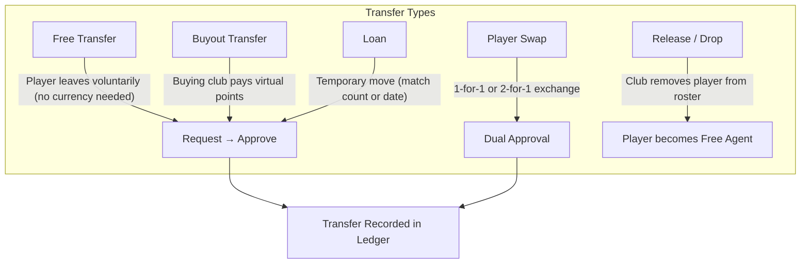
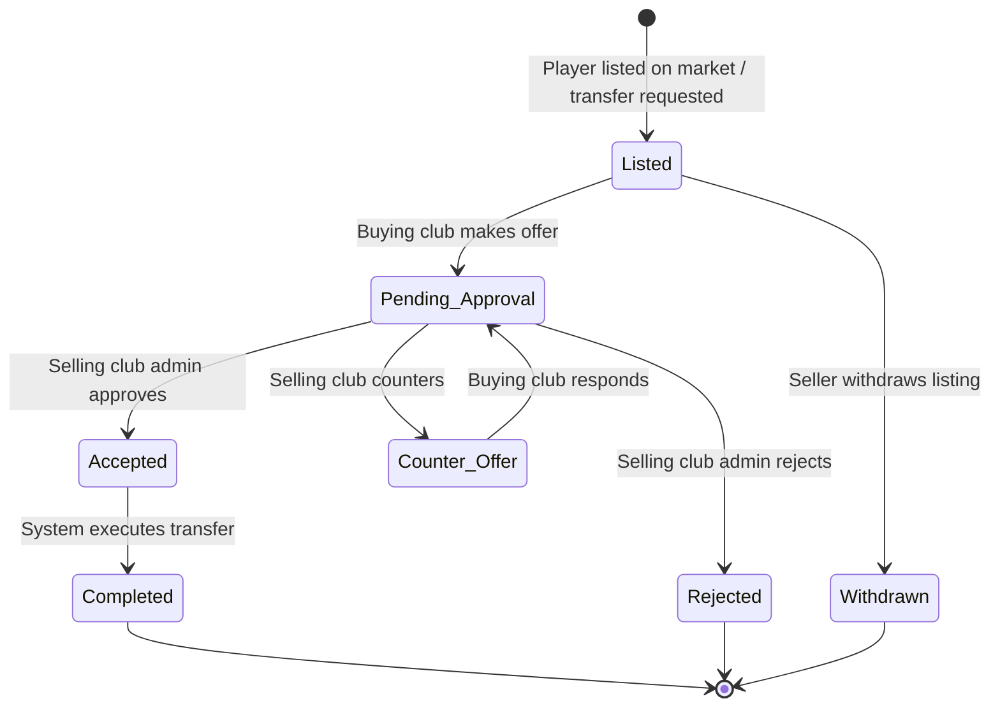
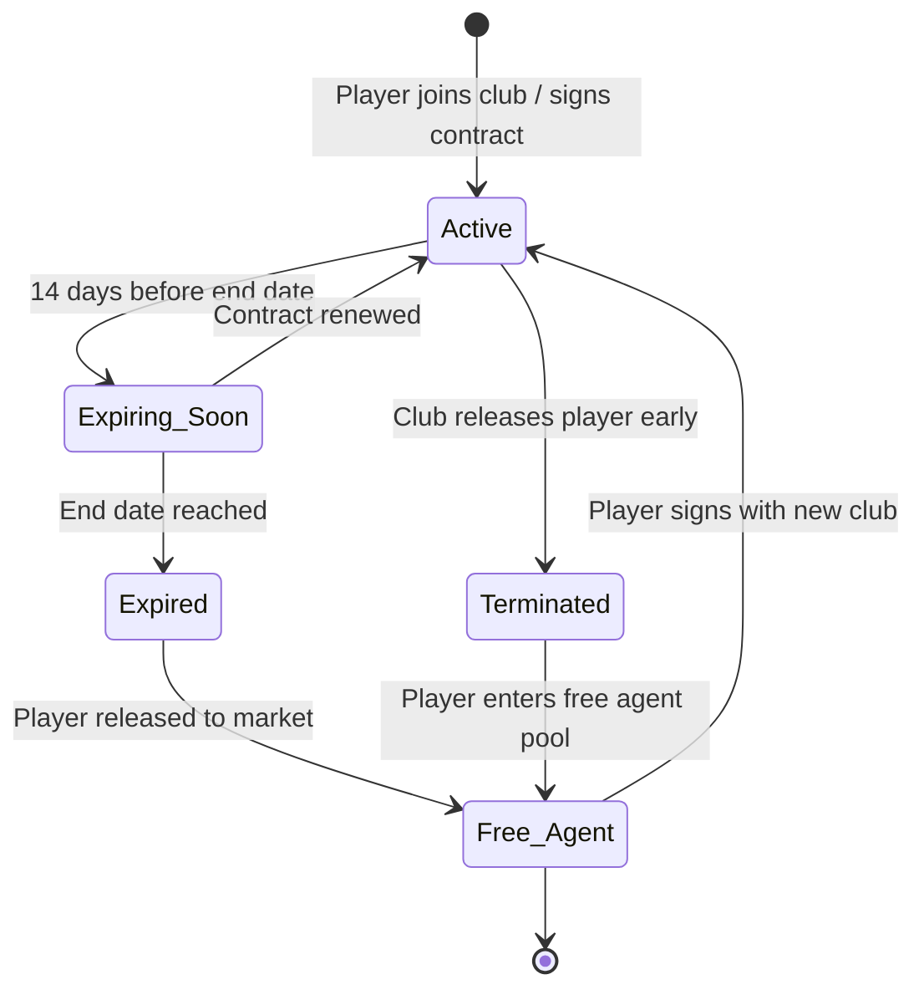
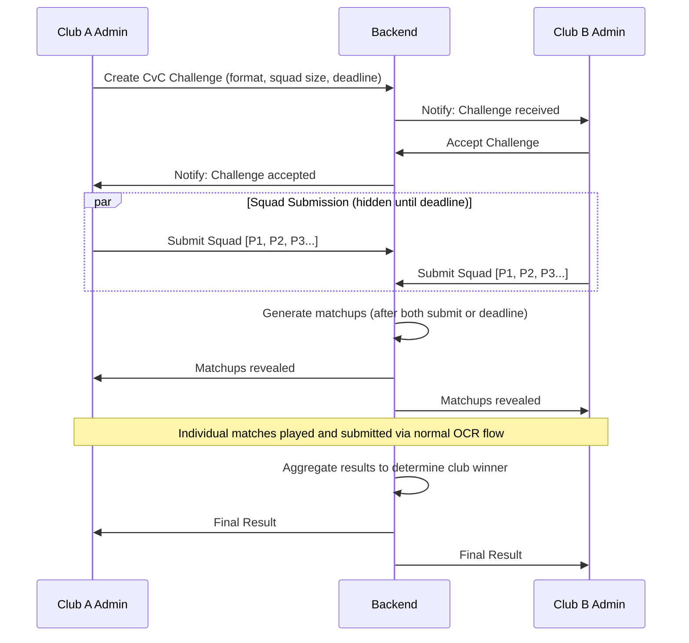
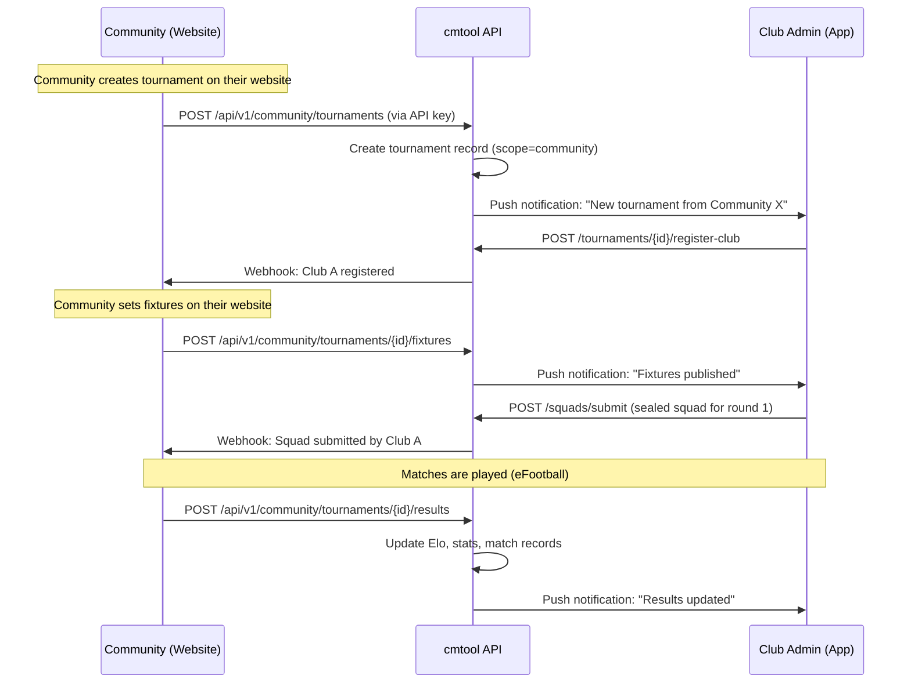
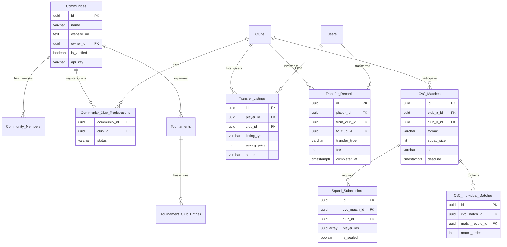

# Transfer Market & Feature Expansion Analysis
## cmtool as the Central Hub for Bangladesh eFootball Communities

> [!NOTE]
> This analysis paper maps concepts from the [deep research report](file:///home/nulL/Documents/cmtool/deep-research-report.md) to our eFootball club management app's architecture. The vision has evolved: **cmtool is not just a club management tool — it's the central spine that Bangladesh eFootball communities plug into**, providing one database, one transfer market, and one club identity across all community platforms.

---

## 1. Context: What We Already Have

Based on the current [specification](file:///home/nulL/Documents/cmtool/docs/specification.md) and [API client](file:///home/nulL/Documents/cmtool/mobile/lib/infrastructure/api_client.dart), the app currently supports:

| Domain | Current State |
|--------|--------------|
| **Clubs** | Create, join via invite code, manage members, roles (admin/organizer/player), ownership transfer, leave/delete |
| **Players** | Profiles, Elo rating (1v1 & 2v2), MPS, Form Rating, Play Style, badges |
| **Matches** | OCR submission, dual-confirmation, disputes, void engine, H2H, match history |
| **Tournaments** | Knockout brackets, round-robin leagues, matchday scheduling, forfeit claims, standings, PDF export |
| **Seasons** | Snapshots, archives |

### 1.1 The Bangladesh eFootball Community Problem

In Bangladesh, multiple communities organize eFootball tournaments — club vs club, solo, duo, 4-man, league, knockout formats. **Each community runs its own website** and registration system:

```text
Community A (website)  ←→  Club registers here, enters roster, submits squad
Community B (website)  ←→  Same club re-registers, re-enters roster, re-submits
Community C (website)  ←→  Same club does it ALL over again
```

**The problem**: Every club duplicates work across N communities. There is no single source of truth for club identity, rosters, contracts, or player history.

**Our solution**: cmtool becomes the **central hub** — not a replacement for communities, but the spine they plug into.

```text
                          ┌─────────────┐
  Community A (website) ──┤             ├── Club A (one profile, one roster)
  Community B (website) ──┤   cmtool    ├── Club B (one profile, one roster)
  Community C (website) ──┤  (central   ├── Club C (one profile, one roster)
  Community D (website) ──┤   hub)      ├── Transfer Market (central)
                          └─────────────┘
```

- **Clubs** register once on cmtool → verified across all communities
- **Transfer market** is central — one place for all player movement
- **Squad submission** happens in-app → communities pull the squad
- **Notifications & fixtures** push from communities to clubs in-app
- **Results** sync back from communities to update Elo/stats in cmtool

### 1.2 What's Missing

| Feature | Status |
|---------|--------|
| **Transfer Market** | ❌ Not implemented |
| **Club-vs-Club Matches** | ❌ Not implemented (all matches are player-vs-player within a club) |
| **Community Integration** | ❌ Not implemented (no external platform connectivity) |
| **Squad Submission** | ❌ Not implemented |
| **Contract System** | ❌ Not implemented |
| **Player Valuation** | ❌ Not implemented |
| **Inter-Club Economy** | ❌ Not implemented |

---

## 2. Transfer Market — Our Modified Design

### 2.1 Real World vs. Our World

| Real-World Concept | Our Adaptation | Rationale |
|-------------------|----------------|-----------|
| **FIFA Transfer Windows** (fixed dates) | **Platform Admin-Controlled Transfer Windows** | The platform super-admin (you) sets global transfer window dates via `system_config`. Outside the window, no transfers can be processed. This gives centralized regulatory control — you are the "FIFA" of the platform. |
| **Transfer Fees (€ millions)** | **Virtual Currency points** OR **free transfers only** (configurable per club) | No real money. Clubs choose whether to use a virtual economy or allow free movement. |
| **Agent Fees & Commissions** | ❌ **Omitted** | No agents exist in our ecosystem. Over-engineering. |
| **Third-Party Ownership (TPO)** | ❌ **Omitted** | Not applicable to eFootball. |
| **Amortization & FFP** | **Optional Salary Cap / Squad Size Limit** per club | Simplified "fair play" — clubs can set max roster size (e.g., 15 players) to prevent hoarding talent. |
| **Medical & Visa checks** | ❌ **Omitted** | Not applicable. |
| **International Transfer Certificate (ITC)** | **Transfer Request + Approval Flow** | The selling club admin must approve the transfer (or the player requests a "free release"). |
| **Sell-on Clauses** | ❌ **Omitted for V1** | Too complex for initial release. Can be added later if virtual currency is adopted. |
| **Loan System** | ✅ **Simplified Loans** | Player temporarily joins another club for a set number of matches or a time period. Original club retains "ownership". |
| **Pre-Contracts (Bosman)** | ✅ **Contract Expiry System** | Players have time-bound contracts with clubs. When a contract expires, the player becomes a **free agent** and can join any club without selling club approval — the Bosman equivalent. |
| **Swap Deals** | ✅ **Player Swap** | Two clubs agree to exchange players simultaneously. |
| **Transfer Matching System (TMS)** | **In-App Transfer Ledger** | All transfers recorded with full audit trail — who, when, from/to, type. |

### 2.2 Transfer Types We Need



#### Transfer Flow States



### 2.3 Player Valuation Model (Simplified)

Real-world CIES-style algorithms use age, contract length, league quality, and performance. We adapt:

$$V_{player} = \text{BaseValue}(R_{elo}) \times M_{form} \times M_{consistency} \times M_{scarcity}$$

Where:
- **BaseValue(R_elo)**: Maps Elo rating to a base value tier (e.g., 800–999 → 100pts, 1000–1199 → 250pts, 1200–1399 → 500pts, 1400+ → 1000pts)
- **M_form**: `form_rating / 50.0` (normalized around 1.0, so 75 form → 1.5× multiplier)
- **M_consistency**: Based on standard deviation of recent MPS scores (lower σ = more consistent = higher multiplier)
- **M_scarcity**: If the player's play style is rare in the buying club's roster (e.g., only "Counter Attacker" in a club of possession players), value goes up

> [!NOTE]
> **Decision: Hybrid Model (Option C)**. Each club individually toggles whether they operate with virtual currency or free movement. Clubs that enable virtual currency earn points via match wins, tournament placements, and season milestones. Clubs that prefer simplicity use admin-approved free transfers. The `Clubs` table gets a `transfer_mode` field: `'free' | 'currency'`.

### 2.4 Contract System

Since we're including contract expiry, every club membership becomes a **time-bound contract**:

| Property | Description |
|----------|-------------|
| **Start Date** | When the player joined / contract was signed |
| **End Date** | When the contract expires (e.g., 3 months, 6 months, 1 season) |
| **Auto-Renewal** | Optional club setting — auto-renew contracts unless player opts out |
| **Status** | `active`, `expiring_soon` (≤14 days left), `expired` |

#### Contract Lifecycle



#### Impact on Transfers

| Scenario | Contract Status | Approval Needed |
|----------|----------------|----------------|
| Player wants to leave | `active` | Selling club admin must approve |
| Player wants to leave | `expired` | **None** — player walks free (Bosman) |
| Club wants to sell | `active` | Player must accept the destination |
| Club releases player | `active` | Club admin only (unilateral) |
| Free agent signs | `expired` / none | Buying club admin confirms |

#### Schema Addition

The existing `Club_Memberships` table gets new columns:

```sql
ALTER TABLE Club_Memberships
    ADD COLUMN contract_start TIMESTAMPTZ DEFAULT NOW(),
    ADD COLUMN contract_end TIMESTAMPTZ,           -- NULL = indefinite (legacy)
    ADD COLUMN contract_status VARCHAR(20) DEFAULT 'active';  -- 'active', 'expiring_soon', 'expired'
```

A scheduled backend job (or Supabase cron) checks nightly for contracts within 14 days of expiry → marks them `expiring_soon`, and marks fully expired ones as `expired`, moving the player to the free agent pool.

### 2.5 Transfer Authorization Model

The platform uses a **three-layer authorization model**:

#### Layer 1 — Platform Admin ("FIFA")

The platform super-admin (you) controls:
- **Global transfer window** — set open/close dates via `system_config`
- Outside the window, the backend **blocks all transfer API calls** with a `TRANSFER_WINDOW_CLOSED` error
- Can override in emergencies (e.g., force-complete a stuck transfer)

```sql
-- Transfer Windows table
CREATE TABLE Transfer_Windows (
    id UUID PRIMARY KEY DEFAULT gen_random_uuid(),
    name VARCHAR(100) NOT NULL,       -- e.g., 'Summer 2026'
    opens_at TIMESTAMPTZ NOT NULL,
    closes_at TIMESTAMPTZ NOT NULL,
    is_active BOOLEAN DEFAULT true,
    created_at TIMESTAMPTZ DEFAULT NOW()
);
```

#### Layer 2 — Club Admins ("National FA")

Club admins/presidents handle club-level decisions:
- Approve or reject outgoing transfer requests
- List players on the transfer market
- Release players (terminate contracts early)
- Accept or reject incoming offers
- Offer contract renewals to expiring players

#### Layer 3 — Players

Players have agency over their own career:
- Request a transfer (signals intent to leave)
- Accept or reject offers from buying clubs
- Walk away as a free agent when contract expires (no approval needed)
- Accept or reject contract renewal offers

#### Authorization Matrix

| Action | Transfer Window | Club Admin | Player | System |
|--------|:-:|:-:|:-:|:-:|
| List player on market | Must be open | ✅ Approves | — | Validates eligibility |
| Make offer on player | Must be open | ✅ Buying club | — | Validates roster size |
| Accept incoming offer | Must be open | ✅ Selling club | ✅ Must accept | Executes transfer |
| Free agent signing | Must be open | ✅ Buying club | ✅ Accepts | Validates roster size |
| Contract expired → free agent | Any time | — | — | ✅ Automatic |
| Release / drop player | Any time | ✅ Unilateral | — | Moves to free agent pool |
| Contract renewal | Any time | ✅ Offers | ✅ Accepts | Updates contract dates |

---

## 3. Club-vs-Club Matches (Inter-Club)

### 3.1 Current Limitation

All matches in the current system are **player-vs-player within a single club**. The `Match_Records` table has a `club_id` FK that scopes everything to one club. There's no concept of "Club A challenges Club B."

### 3.2 Proposed Design

#### What is a Club-vs-Club Match?

A structured event where **Club A** and **Club B** each submit a **squad** of N players, and those players are paired up for a series of 1v1 (or 2v2) eFootball matches. The aggregate result determines the club winner.

#### Match Structure Options

| Format | Description | Use Case |
|--------|-------------|----------|
| **Best-of-N** | Each club submits N players. Player 1 vs Player 1, Player 2 vs Player 2, etc. Club with most individual wins wins. | Quick scrimmages |
| **Round-Robin CvC** | Every player from Club A plays every player from Club B. Total points determine winner. | Full inter-club battle |
| **Captain's Pick** | Captains alternate picking matchups from the submitted squads. | Strategic, high-engagement |

#### Squad Submission Flow



> [!TIP]
> Squad submissions should be **sealed** (hidden from the opponent) until both clubs submit or the deadline passes. This prevents gaming matchups by reacting to the opponent's squad.

### 3.3 Club Elo Rating

Currently, only **players** have Elo ratings. For CvC matches, we need a **Club Elo**:

$$R_{club} = \frac{1}{|S|} \sum_{p \in S} R_p$$

Where $S$ is the set of players who participated in the CvC match (not the full roster). Club Elo adjustments follow the same dynamic K-factor system but use the average squad Elo as the baseline.

---

## 4. Communities & External Integration (Platform Hub Model)

### 4.1 The Key Insight

**Communities are not internal entities — they're external platforms that integrate with cmtool.**

The current tournament system is scoped to a single club. But the real-world model in Bangladesh is that **external communities** (with their own websites) organize cross-club tournaments. Our job is NOT to replace them — it's to give clubs a **single hub** so they don't have to re-register everywhere.

### 4.2 What Communities Are

| | Club (existing) | Community (new) |
|--|----------------|----------------|
| **Has players?** | ✅ Yes (roster) | ❌ No |
| **Has matches?** | ✅ Yes (OCR submissions) | ❌ No (they run on their own site) |
| **Creates tournaments?** | Club-internal only | ✅ Cross-club tournaments |
| **Has a website?** | No (uses cmtool app) | ✅ Yes (their own external site) |
| **Role in cmtool** | Primary user | Integration partner |

Communities are the **"UEFA / local FA"** of the Bangladesh eFootball scene. They organize, cmtool provides the club infrastructure.

### 4.3 Community Entity

```sql
CREATE TABLE Communities (
    id UUID PRIMARY KEY DEFAULT gen_random_uuid(),
    name VARCHAR(100) NOT NULL,           -- e.g., "Dhaka eFootball Community"
    description TEXT,
    website_url TEXT,                      -- link to their external platform
    owner_id UUID NOT NULL REFERENCES Users(id),
    is_verified BOOLEAN DEFAULT false,    -- platform admin grants verification
    logo_url TEXT,
    api_key VARCHAR(64) UNIQUE,           -- for API integration
    api_key_created_at TIMESTAMPTZ,
    created_at TIMESTAMPTZ DEFAULT NOW(),
    updated_at TIMESTAMPTZ DEFAULT NOW(),
    deleted_at TIMESTAMPTZ
);

CREATE TABLE Community_Members (
    community_id UUID REFERENCES Communities(id) ON DELETE CASCADE,
    user_id UUID REFERENCES Users(id) ON DELETE CASCADE,
    role VARCHAR(20) DEFAULT 'organizer', -- 'owner', 'organizer', 'moderator'
    joined_at TIMESTAMPTZ DEFAULT NOW(),
    PRIMARY KEY (community_id, user_id)
);

-- Which clubs are registered with which communities
CREATE TABLE Community_Club_Registrations (
    community_id UUID REFERENCES Communities(id) ON DELETE CASCADE,
    club_id UUID REFERENCES Clubs(id) ON DELETE CASCADE,
    registered_at TIMESTAMPTZ DEFAULT NOW(),
    status VARCHAR(20) DEFAULT 'active',  -- 'active', 'suspended'
    PRIMARY KEY (community_id, club_id)
);
```

### 4.4 How It Works — The Integration Flow



### 4.5 Two Modes of Tournament Interaction

| Mode | Who Manages | What cmtool Does |
|------|------------|------------------|
| **Community-Managed** (primary) | Community runs the tournament on their website | cmtool handles: club registration, squad submission, notifications, Elo/stats sync. Community sends fixtures & results via API. |
| **cmtool-Managed** (secondary) | Platform admin or community creates tournament fully in cmtool | Full existing tournament system (brackets, matchdays, standings) — works for communities without their own website |

### 4.6 Tournament Scope Levels (Updated)

| Scope | `club_id` | `community_id` | Who Can Participate |
|-------|:-:|:-:|-------------------|
| **Club Internal** (existing) | Required | NULL | Only members of that club |
| **Community-Managed** | NULL | Required | Clubs registered with that community |
| **Open / Universal** | NULL | NULL or set | Any registered club/player |
| **Club-vs-Club** | NULL | NULL or set | Clubs submit squads; bracket of clubs |

### 4.7 Community Integration API

Communities authenticate via **API key** (issued by platform admin when verifying the community).

| Method | Endpoint | Description |
|--------|----------|-------------|
| `POST` | `/api/v1/community/tournaments` | Create a tournament (community-managed) |
| `PUT` | `/api/v1/community/tournaments/{id}` | Update tournament details |
| `POST` | `/api/v1/community/tournaments/{id}/fixtures` | Push fixtures to clubs |
| `POST` | `/api/v1/community/tournaments/{id}/results` | Push match results (updates Elo/stats) |
| `GET` | `/api/v1/community/clubs/{id}/roster` | Pull a club's verified roster |
| `GET` | `/api/v1/community/clubs/{id}/squads/{tournament_id}` | Pull submitted squad for a tournament |
| `GET` | `/api/v1/community/players/{id}/profile` | Pull player profile & stats |
| `POST` | `/api/v1/community/webhooks/register` | Register webhook URL for events |

#### Webhook Events (cmtool → Community)

| Event | Payload | When |
|-------|---------|------|
| `club.registered` | Club ID, name, roster summary | Club joins a community tournament |
| `squad.submitted` | Squad player list, tournament ID | Club submits a squad |
| `squad.updated` | Updated squad, substitution details | Club makes a substitution |
| `club.transfer` | Player ID, from/to club | A transfer affects a registered club's roster |

### 4.8 What Clubs Experience

From the **club admin's perspective** in the cmtool Flutter app:

1. Browse communities → join/register with a community
2. See tournaments from all joined communities in one feed
3. Tap "Participate" → confirm entry
4. Submit squad from the app (sealed until deadline)
5. Get fixture notifications in-app
6. Tap to open community website for live tables/results
7. Results sync back → player stats & Elo update automatically

> [!TIP]
> The club never needs to visit the community's website to register, submit rosters, or re-enter player data. They do everything from cmtool. They only visit the community website for **live tournament tables and streaming** — the things communities are already good at.

---

## 5. Squad Submission System

### 5.1 Purpose

For both **CvC matches** and **club-vs-club tournaments**, clubs need to formally submit their lineup before a match/round.

### 5.2 Data Model

```sql
-- Squad Submissions for CvC Matches or Tournament Rounds
CREATE TABLE Squad_Submissions (
    id UUID PRIMARY KEY DEFAULT gen_random_uuid(),
    -- Context: either a CvC match or a tournament round
    cvc_match_id UUID REFERENCES CvC_Matches(id) ON DELETE CASCADE,
    tournament_id UUID REFERENCES Tournaments(id) ON DELETE CASCADE,
    round_number INT,  -- for tournament context
    -- Who submitted
    club_id UUID NOT NULL REFERENCES Clubs(id) ON DELETE CASCADE,
    submitted_by UUID NOT NULL REFERENCES Users(id),
    -- Squad details
    player_ids UUID[] NOT NULL,  -- ordered array of player UUIDs
    is_sealed BOOLEAN DEFAULT TRUE,  -- hidden from opponent until reveal
    -- Timestamps
    submitted_at TIMESTAMPTZ DEFAULT NOW(),
    revealed_at TIMESTAMPTZ,  -- when opponent's submission was also in
    
    CONSTRAINT chk_context CHECK (
        (cvc_match_id IS NOT NULL) OR (tournament_id IS NOT NULL AND round_number IS NOT NULL)
    )
);
```

### 5.3 Business Rules

1. **Squad Size**: Configurable per event (e.g., min 3, max 11 players)
2. **Deadline Enforcement**: If a club doesn't submit by deadline, they can either forfeit or auto-select top-N players by Elo
3. **Player Eligibility**: A player must be a member of the club at submission time. Transferred players cannot play for their old club.
4. **Substitutions**: Optional — allow a limited number of substitutions before the match series begins (but after reveal)
5. **Double Registration Prevention**: A player cannot be in two different squads for concurrent events

---

## 6. Enhanced Club Features

### 6.1 Club Profile & Branding

| Feature | Description |
|---------|-------------|
| **Club Badge / Logo** | Upload or select from preset icons |
| **Club Bio / Description** | Short text description visible to other clubs |
| **Club Stats Dashboard** | Win rate, total matches, avg Elo, active players |
| **Club History** | CvC match history, tournament participation, transfer log |

### 6.2 Inter-Club Discovery

| Feature | Description |
|---------|-------------|
| **Public Club Directory** | Browse/search clubs (opt-in visibility) |
| **Challenge Board** | Post or accept CvC challenges |
| **Club Rankings** | Global leaderboard of clubs by Club Elo |

### 6.3 Club Roles Expansion

Current roles: `admin`, `organizer`, `player`

| New Role | Permissions |
|----------|------------|
| **President** | Full club control, can appoint admins, approve transfers, set club policies |
| **Captain** | Submit squads, represent club in CvC negotiations |
| **Vice-Captain** | Backup for Captain duties |
| **Scout** | Can browse transfer market and recommend players |
| **Transfer Committee** | Can approve/reject incoming transfer offers |

> [!WARNING]
> Adding too many roles increases complexity. Consider starting with just **President** and **Captain** as functional additions, and keep the rest for a future iteration.

---

## 7. Proposed New Database Tables



---

## 8. New API Endpoints Required

### Transfer Market

| Method | Endpoint | Description |
|--------|----------|-------------|
| `GET` | `/api/v1/transfers/market` | Browse transfer listings (paginated, filterable) |
| `POST` | `/api/v1/transfers/list-player` | List a player on the transfer market |
| `DELETE` | `/api/v1/transfers/listings/{id}` | Withdraw a transfer listing |
| `POST` | `/api/v1/transfers/offer` | Make an offer on a listed player |
| `POST` | `/api/v1/transfers/offers/{id}/respond` | Accept/reject/counter an offer |
| `POST` | `/api/v1/transfers/loan` | Initiate a loan agreement |
| `POST` | `/api/v1/transfers/swap` | Propose a player swap |
| `GET` | `/api/v1/transfers/history` | Get transfer history (per player or per club) |
| `POST` | `/api/v1/clubs/{id}/release-player` | Release a player (becomes free agent) |
| `GET` | `/api/v1/players/{id}/valuation` | Get computed player valuation |

### Club-vs-Club

| Method | Endpoint | Description |
|--------|----------|-------------|
| `POST` | `/api/v1/cvc/challenge` | Create a CvC challenge |
| `POST` | `/api/v1/cvc/{id}/respond` | Accept/decline a CvC challenge |
| `POST` | `/api/v1/cvc/{id}/submit-squad` | Submit sealed squad |
| `GET` | `/api/v1/cvc/{id}` | Get CvC match details (matchups revealed after deadline) |
| `GET` | `/api/v1/cvc/{id}/results` | Get aggregated CvC results |
| `GET` | `/api/v1/clubs/{id}/cvc-history` | Club's CvC match history |
| `GET` | `/api/v1/clubs/{id}/club-elo` | Club Elo rating |

### Tournaments & Communities (Club-Facing)

| Method | Endpoint | Description |
|--------|----------|-------------|
| `GET` | `/api/v1/tournaments/discover` | Browse tournaments across all communities |
| `POST` | `/api/v1/tournaments/{id}/register-club` | Register club for a tournament |
| `GET` | `/api/v1/communities` | Browse communities |
| `POST` | `/api/v1/communities/{id}/join` | Register club with a community |
| `GET` | `/api/v1/communities/{id}/tournaments` | Get tournaments from a community |

### Community Integration API (API-Key Authenticated)

| Method | Endpoint | Description |
|--------|----------|-------------|
| `POST` | `/api/v1/community/tournaments` | Community creates a tournament |
| `PUT` | `/api/v1/community/tournaments/{id}` | Update tournament details |
| `POST` | `/api/v1/community/tournaments/{id}/fixtures` | Push fixtures to clubs |
| `POST` | `/api/v1/community/tournaments/{id}/results` | Push results (syncs Elo/stats) |
| `GET` | `/api/v1/community/clubs/{id}/roster` | Pull verified club roster |
| `GET` | `/api/v1/community/clubs/{id}/squads/{tournament_id}` | Pull submitted squad |
| `GET` | `/api/v1/community/players/{id}/profile` | Pull player profile & stats |
| `POST` | `/api/v1/community/webhooks/register` | Register webhook URL |

### Squad Management

| Method | Endpoint | Description |
|--------|----------|-------------|
| `POST` | `/api/v1/squads/submit` | Submit a squad for a CvC match or tournament round |
| `PUT` | `/api/v1/squads/{id}/substitute` | Make a substitution (if allowed) |
| `GET` | `/api/v1/squads/{id}` | Get squad details (sealed or revealed based on state) |

---

## 9. Implementation Priority (Recommended Phases)

### Phase 1 — Transfer Market & Contracts (Build First)
> Core club management that everything else depends on.

| Feature | Effort | Why First |
|---------|--------|-----------|
| Contract system (add columns to Club_Memberships) | Small | Foundation for transfers |
| Contract expiry cron job | Small | Enables Bosman free agency |
| Transfer Market — free movement with approval flow | Medium | Core roster management |
| Transfer Listings + Offers | Medium | Minimum viable market |
| Transfer Ledger / History | Small | Audit trail |
| Transfer Windows (platform admin) | Small | Governance |

### Phase 2 — Communities & Integration API
> **The platform hub layer** — this is the differentiator.

| Feature | Effort | Why |
|---------|--------|-----|
| Communities entity + registration | Medium | External platforms can connect |
| Community API (API key auth) | Large | Core integration layer |
| Club-Community registration flow | Medium | Clubs join communities |
| Tournament push from communities | Medium | Communities send tournaments to cmtool |
| Fixture & result sync via API | Large | Two-way data flow |
| Webhook system (cmtool → communities) | Medium | Real-time event notifications |
| Tournament discovery feed | Medium | Clubs browse all community tournaments |

### Phase 3 — Club-vs-Club & Squads
> The inter-club gameplay loop.

| Feature | Effort | Why |
|---------|--------|-----|
| CvC Match entity + challenge flow | Large | Core new feature |
| Squad Submission (sealed) | Medium | Required for CvC |
| CvC matchup generation + result aggregation | Medium | Determines club winner |
| Club Elo rating | Small | Rankings for clubs |
| Club discovery / public directory | Medium | Clubs find each other |

### Phase 4 — Economy & Polish
> Depth layer — builds on everything above.

| Feature | Effort | Why |
|---------|--------|-----|
| Virtual currency system (hybrid toggle) | Large | Gamification for clubs that want it |
| Player valuation algorithm | Medium | Market pricing |
| Loan system with return dates | Medium | Temporary transfers |
| Player swap mechanism | Medium | Complex transfer type |
| Club branding (logo, bio) | Small | Identity |
| Enhanced roles (Captain, Scout) | Small | Better permissions |

---

## 10. Key Technical Considerations

### 10.1 Data Isolation & Multi-Club Players

> [!NOTE]
> **Decision: Elo Resets on Transfer**. When a player transfers to a new club, their `skill_rating` resets to the default **1000** and `form_rating` resets to **50.00** in the new club. Their old club's ratings are preserved in `Elo_History` and `Season_Snapshots` for the historical record. This means players must re-prove themselves in every new club — no reputation riding.

### 10.2 Preventing Transfer Abuse

- **Cooldown Period**: After transferring, a player cannot transfer again for 7 days (configurable)
- **Tournament Lock**: Players registered in an active tournament cannot be transferred until it concludes
- **Squad Lock**: Once a squad is submitted for a CvC match, those players are locked until the match concludes

### 10.3 Architecture Impact

The hexagonal architecture in [ARCHITECTURE.md](file:///home/nulL/Documents/cmtool/docs/ARCHITECTURE.md) means new domain logic goes in:

```text
backend/src/
 ├── api/
 │    ├── handlers/
 │    │    ├── transfers.rs       # Transfer market HTTP handlers
 │    │    ├── contracts.rs       # Contract management handlers
 │    │    ├── cvc.rs             # Club-vs-Club HTTP handlers
 │    │    ├── communities.rs     # Community HTTP handlers
 │    │    ├── community_api.rs   # Community Integration API (API-key auth)
 │    │    └── squads.rs          # Squad submission handlers
 │    ├── community_auth.rs      # API-key middleware for communities
 │    └── routes.rs              # + new route registrations
 ├── domain/
 │    ├── transfers.rs           # Transfer business rules & validation
 │    ├── contracts.rs           # Contract lifecycle & expiry logic
 │    ├── cvc.rs                 # CvC matchup generation & aggregation
 │    ├── squads.rs              # Squad validation & eligibility
 │    ├── club_elo.rs            # Club-level Elo calculations
 │    ├── valuation.rs           # Player valuation formula
 │    └── webhooks.rs            # Webhook dispatch logic
 └── infrastructure/
      └── postgres_adapter/
           ├── transfers.rs      # Transfer DB queries
           ├── contracts.rs      # Contract DB queries
           ├── cvc.rs            # CvC DB queries
           ├── communities.rs    # Community DB queries
           └── squads.rs         # Squad DB queries
```

### 10.4 Mobile Screen Additions

| Screen | Purpose |
|--------|---------|
| **Transfer Market** | Browse listings, make offers, view player valuations |
| **My Transfers** | Track pending offers, loan status, transfer history |
| **Player Contract** | View contract details, accept renewals |
| **Communities Hub** | Browse & join communities, see their tournaments |
| **Community Detail** | Community info, tournaments, registered clubs |
| **Tournament Discovery** | Browse tournaments across all communities in one feed |
| **CvC Challenge** | Create/accept challenges, submit squads |
| **CvC Match View** | See matchups, individual results, aggregate score |
| **Squad Builder** | Drag-and-drop squad selection for CvC |
| **Club Profile (Public)** | Club stats, CvC history, roster preview |

---

## 11. What We Deliberately Excluded

| Real-World Feature | Why Excluded |
|-------------------|-------------|
| Agent fees & commissions | No agents in eFootball casual play |
| Third-party ownership | Not applicable |
| Amortization & accounting | No real finances |
| Work permits / visas | Not applicable |
| Medical examinations | Not applicable |
| FIFA Clearing House | We build our own simple ledger |
| Sell-on clauses | Too complex for V1 (revisit with virtual currency) |
| Training compensation | No youth academy system |
| Replacing community websites | Communities keep their platforms — we provide the spine, not the skin |

---

## Summary

This analysis transforms the real-world transfer research into **5 actionable feature modules** designed around the **platform hub vision** — cmtool as the central spine for Bangladesh eFootball communities:

1. **Transfer Market** — One central market with contracts, approval flows, and platform admin-controlled windows
2. **Contract System** — Time-bound contracts with Bosman-style free agency on expiry
3. **Community Integration** — External communities connect via API to push tournaments, pull rosters, and sync results
4. **Club-vs-Club Matches** — Sealed squad submission, matchup generation, aggregate scoring, Club Elo
5. **Squad System** — Formal lineup management for CvC and community tournament participation

The phased approach prioritizes:
- **Phase 1**: Transfer market & contracts (foundation)
- **Phase 2**: Community integration API (the differentiator — this is what solves the BD community fragmentation problem)
- **Phase 3**: Club-vs-Club gameplay
- **Phase 4**: Economy & polish

> [!IMPORTANT]
> The platform hub model means cmtool's value grows with every community that integrates. Each new community brings their clubs into one central database — no more fragmented rosters and repeated registrations.
